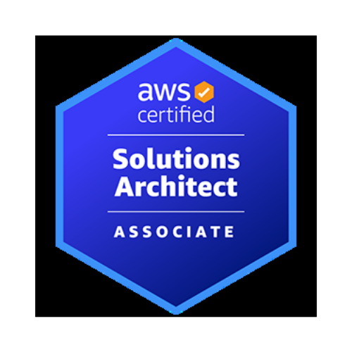

<h1>DevOps Engineer</h1>

  Este portfólio é o reflexo do meu dia a dia como profissional DevOps: aqui você encontrará 
  anotações técnicas, boas práticas, automações com ferramentas como Docker, Kubernetes, GitHub Actions e mais. 
  Tudo que aprendo, aplico e compartilho.

<a class="bnt-hero" href="http://127.0.0.1:8000/#contato">Saiba Mais</a>
---

<!-- About Section -->
##<h2>Sobre mim</h2>

Olá! Sou Vinicius Costa, <strong>DevOps Engineer</strong> com 2 anos de experiência em tornar ciclos de desenvolvimento e implantação mais ágeis, seguros e escaláveis. Sou movido por desafios técnicos e pela melhoria contínua dos processos de entrega de software.  
Minha expertise inclui:
<ul>
<li>Implementação de pipelines <strong>CI/CD</strong> (GitLab, Jenkins, GitHub Actions)</li>
<li>Orquestração de containers com <strong>Kubernetes</strong> e <strong>Docker</strong></li>
<li>Infraestrutura como código (<strong>Terraform</strong>, Ansible)</li>
<li>Monitoramento com <strong>Prometheus</strong> e <strong>Grafana</strong></li>
</ul>

---

<!-- Certifications Section -->
##<h2>Certificações</h2>

<!-- Certification cards grid -->

<!-- Repeated card is intentional, as requested -->

  
  <h3>AWS Cloud Practitioner</h3>
  
Amazon Web Services

  
Emitida: Mai 2025

  <a class="creden" href="https://www.credly.com/badges/05583c87-adf7-4888-93f5-f28229c29078/linked_in_profile">Ver Credencial</a>

  
  <h3>AWS SAA - C03</h3>
  
Amazon Web Services

  
Em andamento...

  <a class="creden" href="https://google.com">Ver Credencial</a>

  
  <h3>Kubernetes</h3>
  
DevOps-Pro

  
Emitida: Abr 2025

  <a class="creden" href="https://certificado.devopspro.com.br/certificado?code=7d248654-51eb-493a-a75d-a2eb581cb4a2">Ver Credencial</a>

  
  <h3>Docker</h3>
  
DevOps-Pro

  
Emitida: Fev 2025

  <a class="creden" href="https://certificado.devopspro.com.br/certificado?code=6cd6ad91-1ec6-4421-b390-2d6a0046678e">Ver Credencial</a>

  
  <h3>Linux</h3>
  
DevOps-Pro

  
Emitida: Jan 2025

  <a class="creden" href="https://certificado.devopspro.com.br/certificado?code=ab5e20b1-a3c7-4397-b2f2-4250058c9eb8">Ver Credencial</a>

  
  <h3>GitHub Actions</h3>
  
DevOps-Pro

  
Em andamento...

  <a class="creden" href="https://vinnycloud.com.br">Ver Credencial</a>

---

<!-- Projects Section -->
##<h2>Projetos</h2>

<!-- Project cards container -->

  
  <h3>Em andamento</h3>
  <a class="creden" href="https://vinnycloud.com.br">Ver Projeto</a>

  
  <h3>Em andamento</h3>
  <a class="creden" href="https://vinnycloud.com.br">Ver Projeto</a>

  
  <h3>Em andamento</h3>
  <a class="creden" href="https://vinnycloud.com.br">Ver Projeto</a>

---

<!-- FAQ Section -->
##<h2>FAQ</h2>

<!-- FAQ list using details/summary -->

  
Por que você criou este site?

   
  Para documentar meu aprendizado em DevOps, organizar minhas anotações e compartilhar conhecimento com outros profissionais da área.
    

  
Posso usar esse conteúdo?

   
  Sim! Todo o conteúdo é aberto. Sinta-se à vontade para estudar, compartilhar ou até sugerir melhorias.
    

<!-- Duplicates are kept as instructed -->

  
Você está aberto a oportunidades?

   
  Sim! Estou sempre aberto a novos desafios profissionais na área de DevOps e Cloud. Entre em contato pelos canais no final da página.
    

  
Com quais ferramentas você trabalha no dia a dia?

   
  Costumo utilizar Docker, Kubernetes, Terraform, GitHub Actions, além de ferramentas de monitoramento como Prometheus e Grafana.
    

---

<!-- Contact Section -->
##<h2>Contato</h2>

<!-- Contact cards section -->

  <!-- LinkedIn -->
  <a href="https://www.linkedin.com/in/solutions-architec/" class="contact-card" target="_blank" rel="noopener noreferrer">
    

      
    

    

      <h3>LinkedIn</h3>
      
Conecte-se profissionalmente

    

  </a>

  <!-- WhatsApp -->
  <a href="https://wa.me/5519999708720" class="contact-card" target="_blank" rel="noopener noreferrer">
    

      
    

    

      <h3>WhatsApp</h3>
      
Entre em contato diretamente

    

  </a>

  <!-- GitHub -->
  <a href="https://github.com/vinicius3516" class="contact-card" target="_blank" rel="noopener noreferrer">
    

      
    

    

      <h3>GitHub</h3>
      
Veja meus projetos e contribuições

    

  </a>

  <!-- Email -->
  <a href="mailto:costavinicius692@.com?subject=Contato%20via%20Portfolio" class="contact-card" target="_blank" rel="noopener noreferrer">
    

      
    

    

      <h3>E-mail</h3>
      
Entre em contato comigo por e-mail

    

  </a>

---

<!-- Footer -->

© 2025 Vinicius Costa. Todos os direitos reservados.

